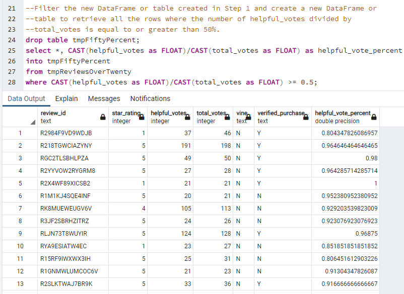
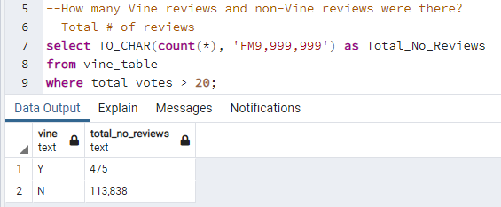
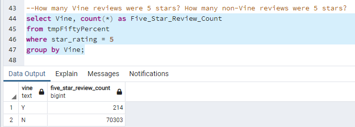
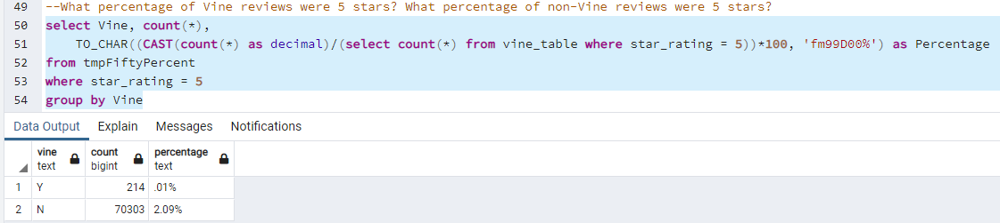

# Challenge 16 - Amazon Vine Analysis
## Overview of the Analysis
The following report provides an analysis of Amazon reviews written by members of the paid Amazon Vine program. The selected product for this analysis is "Health Personal Care". Data was obtained from an AWS S3 bucket. The data from extracted, cleaned, and transformed to populate a Postgres databased publicly located on an AWS RDS database instance.

* Amazon AWS S3 Data URL: https://s3.amazonaws.com/amazon-reviews-pds/tsv/amazon_reviews_us_Health_Personal_Care_v1_00.tsv.gz]
* Postgres Database Name: amazon_review_db
* Postgres Table Names: customers_table, products_table, review_id_table, and vine_table

## Results
For the analysis, only reviews with total votes of more than 20 were used. There were 125,308 reviews with 20+ total votes. From there, only reviews with helpful votes that 50% of the total votes were used. There were 114,313 reviews.

### Vine Review Count
Below is the breakout of review for each type: Vine and Non-Vine

### Number 5-Star Reviews
There were a total of 70,517 5-Star reviews. Below is the breakout of those review between Vine and Non-Vine. 

### 5-Star Review Statistics
Below is the percentage of 5-Star reviews per type of review over the total.

## Summary
Based on this particular data for the "Health Personal Care" products on Amazon, the Vine paid reviews don't seem to offer much advantage. The majority of the reviews are Non-Vine (unpaid) reviews. Therefore, there seems to be no bias with regards to being paid to review or not.

Additional Analysis Recommendation: How did a review (paid vs. unpaid) affect verified purchases. How many paid review resulted in a "verified_purchase (column in table)" vs. unpaid.

